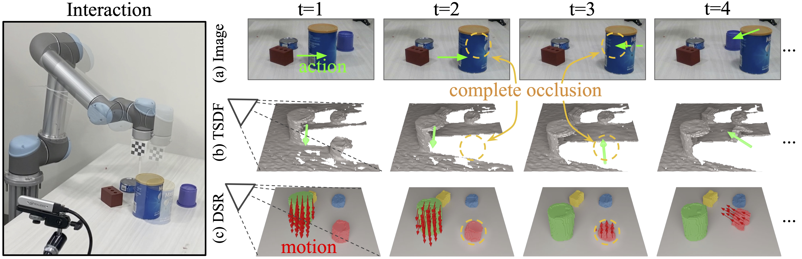

# Learning 3D Dynamic Scene Representations for Robot Manipulation

[Zhenjia Xu](http://www.zhenjiaxu.com/)<sup>1\*</sup>,
[Zhanpeng He](https://zhanpenghe.github.io/)<sup>1\*</sup>,
[Jiajun Wu](https://jiajunwu.com/)<sup>2</sup>,
[Shuran Song](https://www.cs.columbia.edu/~shurans/)<sup>1</sup>
<br>
<sup>1</sup>Columbia University, <sup>2</sup>Stanford University
<br>
[CoRL 2020](https://www.robot-learning.org/)

### [Project Page](https://dsr-net.cs.columbia.edu/) | [Video](https://youtu.be/GQjYG3nQJ80) | [arXiv](https://arxiv.org/abs/2011.01968)

## Overview
This repo contains the PyTorch implementation for paper "Learning 3D Dynamic Scene Representations for Robot Manipulation".


## Content

- [Prerequisites](#prerequisites)
- [Data Preparation](#data-preparation)
- [Pretrained Models](#pretrained-models)
- [Training](#training)

## Prerequisites

The code is built with Python 3.6. Libraries are listed in [requirements.txt](requirements.txt):

## Data Preparation

### Download Testing Data
The following two testing datasets can be download.
- [Sim](https://dsr-net.cs.columbia.edu/download/data/sim_test_data.zip): 400 sequences, generated in pybullet. 
- [Real](https://dsr-net.cs.columbia.edu/download/data/real_test_data.zip): 150 sequences, with full annotations.

### Generate Training Data
Download object mesh: [shapenet](https://dsr-net.cs.columbia.edu/download/object_models/shapenet.zip) and [ycb](https://dsr-net.cs.columbia.edu/download/object_models/ycb.zip).

To generate data in simulation, one can run
```
python data_generation.py --data_path [path to data] --train_num [number of training sequences] --test_num [number of testing sequences] --object_type [type of objects]
```
Where the `object_type` can be `cube`, `shpenet`, or `ycb`.
The training data in the paper can be generated with the followint scripts:
```
# cube
python data_generation.py --data_path data/cube_train --train_num 4000 --test_num 400 --object_type cube

# shapenet
python data_generation.py --data_path data/shapenet_train --train_num 4000 --test_num 400 --object_type shapenet
```

## Pretrained Models
Some of the pretrained models can be download in [pretrained_models](pretrained_models).
To evaluate the pretrained models, one can run
```
python test.py --resume [path to model] --data_path [path to data] --model_type [type of model] --test_type [type of test]
```
where `model_type` can be one of the following:
- `dsr`: DSR-Net introduced in the paper.
- `single`: It does not use any history aggregation.
- `nowarp`: It does not warp the representation before aggregation.
- `gtwarp`: It warps the representation with ground truth motion (i.e., performance oracle)
- `3dflow`: It predicts per-voxel scene flow for the entire 3D volume.

Both motion prediction and mask prediction can be evaluated by choosing different `test_type`:
- motion prediction: `motion_visible` or `motion_full`
- mask prediction: `mask_ordered` or `mask_unordered`

(Please refer to our paper for detailed explanation of each type of evaluation)

Here are several examples:
```
# evaluate mask prediction (ordered) of DSR-Net using real data:
python test.py --resume [path to dsr model] --data_path [path to real data] --model_type dsr --test_type mask_ordered

# evaluate mask prediction (unordered) of DSR-Net(finetuned) using real data:
python test.py --resume [path to dsr_ft model] --data_path [path to real data] --model_type dsr --test_type mask_unordered

# evaluate motion prediction (visible surface) of NoWarp model using sim data:
python test.py --resume [path to nowarp model] --data_path [path to sim data] --model_type nowarp --test_type motion_visible

# evaluate motion prediction (full volume) of SingleStep model using sim data:
python test.py --resume [path to single model] --data_path [path to sim data] --model_type single --test_type motion_full
```


## Training
Various training options can be modified or toggled on/off with different flags (run `python main.py -h` to see all options):
```
usage: train.py [-h] [--exp EXP] [--gpus GPUS [GPUS ...]] [--resume RESUME]
                [--data_path DATA_PATH] [--object_num OBJECT_NUM]
                [--seq_len SEQ_LEN] [--batch BATCH] [--workers WORKERS]
                [--model_type {dsr,single,nowarp,gtwarp,3dflow}]
                [--transform_type {affine,se3euler,se3aa,se3spquat,se3quat}]
                [--alpha_motion ALPHA_MOTION] [--alpha_mask ALPHA_MASK]
                [--snapshot_freq SNAPSHOT_FREQ] [--epoch EPOCH] [--finetune]
                [--seed SEED] [--dist_backend DIST_BACKEND]
                [--dist_url DIST_URL]
```
### Training of DSR-Net
Since the aggregation ability depends on the accuracy of motion prediction, we split the training process into three stages from easy to hard: (1) single-step on cube dataset; (2) multi-step on cube dataset; (3) multi-step on ShapeNet dataset. 
```
# Stage 1 (single-step on cube dataset)
python train.py --exp dsr_stage1 --data_path [path to cube dataset] --seq_len 1 --model_type dsr --epoch 30

# Stage 2 (multi-step on cube dataset)
python train.py --exp dsr_stage2 --resume [path to stage1] --data_path [path to cube dataset] --seq_len 10 --model_type dsr --epoch 20 --finetune

# Stage 3 (multi-step on shapenet dataset)
python train.py --exp dsr_stage3 --resume [path to stage2] --data_path [path to shapenet dataset] --seq_len 10 --model_type dsr --epoch 20 --finetune
```

### Training of Baselines
- `nowarp` and `gtwarp`. Use the same scripts as DSR-Net with corresponding `model_type`.

- `single` and `3dflow`. Two-stage training: (1) single step on cube dataset; (2) single step on Shapenet dataset.

## BibTeX
```
@inproceedings{xu2020learning,
    title={Learning 3D Dynamic Scene Representations for Robot Manipulation},
    author={Xu, Zhenjia and He, Zhanpeng and Wu, Jiajun and Song, Shuran},
    booktitle={Conference on Robotic Learning (CoRL)},
    year={2020}
}
```

## License

This repository is released under the MIT license. See [LICENSE](LICENSE) for additional details.


## Acknowledgement

- The code for [TSDF fusion](fusion.py) is modified from [tsdf-fusion](https://github.com/andyzeng/tsdf-fusion).
- The code for [binvox processing](binvox_utils.py) is modified from [binvox-rw-py](https://github.com/dimatura/binvox-rw-py).
